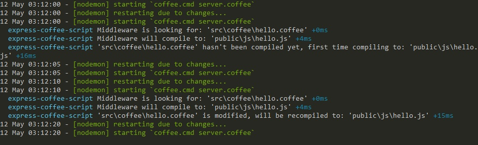

# Express Coffee Script

An Express middleware for CoffeeScript.

[](https://nodei.co/npm/express-coffee-script/)

## How to use?
Put it into your Express like this:
```coffee
coffee = require 'express-coffee-script'
app = express()

app.use coffee(
  src: 'src/coffee'
  dest: 'public/js'
  prefix: '/js' # will remove /js from .coffee file path
  compilerOpts: bare: true
)

app.use express.static 'public'
```

*express-coffee-script* compiles your CoffeeScript files only, it doesn't serve them. You need to use *express.static* because *express.static* serves your compiled JS files not this middleware.

## How to install?
[](https://nodei.co/npm/express-coffee-script/)

Every version under 1.0 is beta, this means it may have bugs, use with care :wink:

## Options

### src (*string*)
This is a directory that contains your CoffeeScript files.

### dest (*string*)
This is a directory where your CoffeeScript files will be saved to.

### prefix (*string*)
Let's say:
```cson
{
  'src': 'src/coffee'
  'public': 'public/js'
  'prefix': '/js'
}
```
This is our configuration for our middleware.

If we request `localhost/js/test.js`:

Our middleware will look for this file: `src/coffee/js/test.js`

But if we add *prefix* as `/js`:

Our middleware will look for this file: `src/coffee/test.js`

### compile (*function*)
With this function you can customize your compiler:

In this example we will use `coffee-react` instead of `coffee-script`
```coffee
app.use coffee
  src: 'src/coffee'
  dest: 'public/js'
  prefix: '/js'
  compile: require('coffee-react')
  compilerOpts: { bare: true }
  ext: '.cjsx'
```

### compilerOpts (*object*)
This object will be passed to the compile function.

### ext (*string*)
Middleware will look for this file extension. Default value is `.coffee`

## Screenshot



Note: Screenshot is taken in *DEBUG* mode. You will not see these messages unless you set DEBUG to `express-coffee-script`
